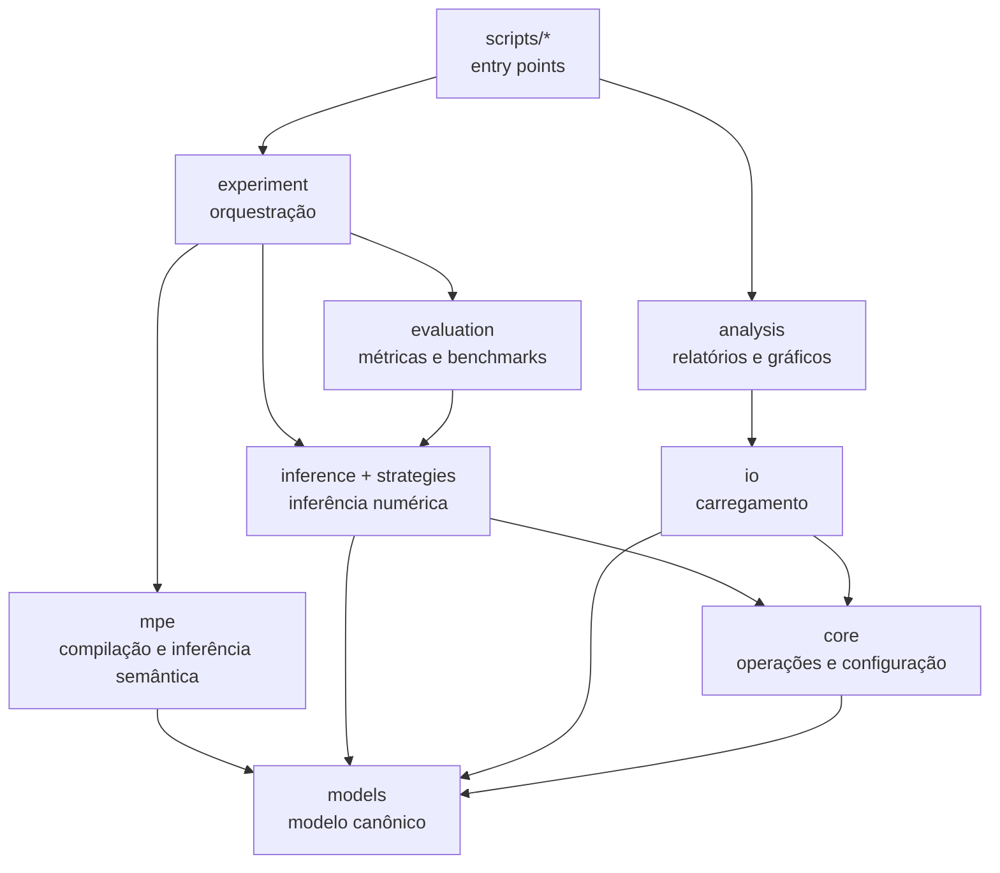

# Arquitetura

Este documento descreve a arquitetura implementada no código atual. O
[README](../README.md) é o guia de uso; o
[PROJECT_CONTEXT](PROJECT_CONTEXT.md) explica o problema científico; e o
[AGENTS](AGENTS.md) contém regras operacionais para alterações no projeto.

## 1. Visão geral

O projeto contém dois pipelines que compartilham o mesmo modelo de Rede
Bayesiana:

1. **Pipeline numérico:** executa Variable Elimination sobre fatores e CPTs,
   usando Sum-Product ou Max-Product.
2. **Pipeline semântico LLM-MPE:** usa um LLM durante uma fase de compilação
   para produzir tabelas de decisão qualitativas. As inferências posteriores
   fazem apenas lookup nessas tabelas.

O experimento principal compara a saída semântica com o Max-Product numérico,
que funciona como referência.

## 2. Direção das dependências



Regras dessa direção:

- `scripts/` pode depender das camadas de aplicação e domínio, mas nenhuma
  camada reutilizável deve importar `scripts/`;
- scripts não importam outros scripts;
- `experiment/` coordena componentes, mas não contém operações matemáticas de
  fatores nem parsing de formatos;
- `analysis/` contém cálculos e visualizações reutilizáveis; `scripts/analysis/`
  apenas escolhe entradas e executa relatórios;
- `models/` não depende de experimentos, LLMs, logs ou análise;
- caminhos de artefatos vêm de `paths.py`, nunca de contagens locais de
  `Path.parents`.

## 3. Entry points

### Execução

| Módulo | Responsabilidade |
|---|---|
| `scripts.run.main` | Batch principal sobre datasets e diferentes evidências. |
| `scripts.run.main_single_run` | Execução pequena com dataset e evidência fixos. |
| `scripts.run.run_evidence_pos` | Uma evidência por nó para estudar sua posição no DAG. |
| `scripts.run.synthetic_eval` | Avaliação controlada com rede sintética. |
| `scripts.run.get_mpe` | Benchmark Max-Product exato versus decodificação gulosa. |
| `scripts.run.cptless_demo` | Demonstração sem BIF e sem CPT numérica. |

### Análise

| Módulo | Responsabilidade |
|---|---|
| `scripts.analysis.metrics` | Relatório agregado, correlações e seleção de gráficos. |
| `scripts.analysis.evidence_position` | Análise da profundidade da evidência. |
| `scripts.analysis.reinference` | Segunda avaliação semântica por Markov Blanket. |
| `scripts.analysis.get_table` | Estatísticas estruturais e tabela LaTeX. |

Esses módulos devem permanecer finos. Se uma função for útil fora de um único
`main()`, seu lugar provável é `experiment/`, `evaluation/` ou `analysis/`.

## 4. Fluxo do experimento principal

O fluxo começa em `scripts/run/main.py`.

```text
main
 ├─ cria ExperimentConfig
 ├─ seleciona o cliente com experiment.llm_factory.build_llm_fn
 └─ para cada dataset
     ├─ resolve os caminhos por paths.py
     ├─ carrega a rede numérica com io.loaders.load_network
     ├─ calcula os tamanhos de evidência
     ├─ carrega ou cria a compilação semântica com mpe.cache.load_or_compile
     └─ para cada item produzido por experiment.batch.run_batch
         ├─ calcula a referência com Max-Product
         ├─ consulta as mensagens compiladas com mpe.infer
         ├─ calcula os acertos com evaluation.metrics
         └─ grava JSONL com logging.experiment_logger
```

### 4.1 Carregamento numérico

`io.loaders.load_network(path)` seleciona um reader do pgmpy, descompacta o
arquivo quando necessário e chama `core.conversion.convert_pgmpy_model`.

O resultado é sempre um `models.BayesianNetwork` contendo:

- `variables: dict[str, Variable]`;
- `factors: list[Factor]` com valores NumPy;
- topologia derivada dos fatores.

Os formatos suportados são BIF, XDSL, NET, DSC e DNE, opcionalmente com `.gz`.

### 4.2 Geração do batch

`experiment.batch.run_batch` combina:

- tipo de prompt;
- trial;
- tamanho de evidência;
- modo de inferência (`map` ou `mpe`);
- estratégia de amostragem da evidência.

O batch apenas gera configurações. A execução de uma configuração pertence a
`experiment.runner.run_experiment`.

### 4.3 Comparação por configuração

`run_experiment` executa:

1. `experiment.experiment.run_max_product`, usando o motor numérico;
2. `mpe.infer.infer_from_compiled`, usando as tabelas semânticas;
3. `evaluation.metrics.count_llm_hits`, comparando assignments;
4. montagem de um registro serializável para o logger.

No modo MPE, todas as variáveis não observadas são avaliadas. No modo MAP,
somente as variáveis de consulta são avaliadas.

## 5. Pipeline numérico

### Componentes

- `models.Variable`: nome e tupla canônica `states`;
- `models.Factor`: escopo ordenado e tensor NumPy;
- `models.BayesianNetwork`: coleção de variáveis, fatores e topologia;
- `inference.InferenceEngine`: valida a consulta e coordena a eliminação;
- `inference.ve_algorithm`: reduz evidência, escolhe ordem e elimina variáveis;
- `strategies.SumProductStrategy`: elimina por soma;
- `strategies.MaxProductStrategy`: elimina por máximo e mantém argmax;
- `inference.postprocessing`: normaliza distribuições ou reconstrói o MAP/MPE.

### Convenção dos fatores

Para fatores que representam CPDs:

```text
scope[0]  = variável filha
scope[1:] = pais, na ordem dos eixos restantes
values.shape = tuple(cardinalidade(v) for v in scope)
```

Alterar essa convenção exige revisar conversão, amostragem, estrutura do grafo,
decodificação gulosa e testes.

### Configurações distintas

Há duas configurações com escopos diferentes:

- `core.config.InferenceConfig`: runtime, ambiente, cliente LLM e heurística
  numérica;
- `experiment.config.ExperimentConfig`: desenho de um experimento, trials,
  amostragem, modo e limites.

Elas não devem ser fundidas: uma representa infraestrutura; a outra representa
uma execução científica.

## 6. Pipeline semântico

### 6.1 Entrada

O pipeline aceita duas formas de rede:

- um dataset BIF, passado por `bif_path`;
- um `BayesianNetwork` em memória, criado por
  `BayesianNetwork.from_structure`, sem fatores numéricos.

No segundo caso são necessários apenas nomes, estados e arestas. A estrutura
deve ser um DAG.

### 6.2 Compilação

`mpe.compile.compile_semantic_messages` é a única etapa principal que chama o
LLM. Ela:

1. usa a rede BIF semântica ou a rede em memória;
2. carrega ou gera metadados de variáveis;
3. carrega ou gera notas qualitativas de relacionamentos;
4. cria um briefing da rede;
5. obtém a ordem topológica e usa seu reverso como ordem de compilação;
6. cria um `BucketSpec` para cada variável;
7. enumera todas as combinações do separador;
8. divide contextos grandes entre chamadas, quando necessário;
9. valida rigorosamente nomes, estados e cobertura das linhas retornadas;
10. armazena uma `SemanticMessage` por variável.

O objeto resultante é `CompiledSemanticMessages`, contendo mensagens, ordem,
briefing, rede, aliases, metadados, notas, traces e versão de schema.

### 6.3 Invariante atual da compilação

O código atual compila com `evidence={}` e mantém `active_messages` vazio. Isso
significa que cada mensagem é uma tabela local da variável condicionada ao seu
separador estrutural — normalmente seus pais — e que mensagens derivadas não
são propagadas entre buckets durante a compilação.

Essa é uma decisão importante: o comportamento implementado é uma
decodificação semântica tabulada e causal, não uma execução numérica de bucket
elimination. Não introduza propagação de mensagens ou auditoria LLM na fase
online como uma “refatoração”; isso alteraria o método científico.

### 6.4 Inferência online

`mpe.infer.infer_from_compiled`:

1. normaliza aliases e estados da evidência;
2. percorre a ordem de reconstrução;
3. mantém valores observados fixos;
4. consulta a linha correspondente ao contexto já atribuído;
5. devolve assignment oculto, confiança selecionada e uma representação das
   tabelas usada no logging.

Não há chamada ao LLM nessa etapa. A reconstrução é determinística para uma
compilação e uma evidência dadas.

Consequência do algoritmo atual: uma evidência em um descendente não faz uma
nova inferência semântica retroativa sobre seus ancestrais. Qualquer mudança
nisso é alteração algorítmica, não reorganização de código.

## 7. Cache

`mpe.cache.load_or_compile` persiste `CompiledSemanticMessages` por pickle em
`src/tables/`.

O caminho ativo é:

```text
<dataset>.compiled.pkl
```

`model_name` é passado até `compiled_cache_path`. Existe, no próprio arquivo,
um switch comentado para incluir o modelo no nome. Esse comentário é mantido
intencionalmente para alternar experimentos.

O cache possui `COMPILED_SCHEMA_VERSION`. Um pickle sem a versão atual é
rejeitado e provoca nova compilação. Como recompilar pode consumir créditos:

- não apague caches sem solicitação explícita;
- não execute `main`, `cptless_demo` ou compilação real como simples smoke test;
- preserve caches antigos antes de mudar schemas serializados;
- para validar código, use testes com mocks.

## 8. Análise e logging

`logging.experiment_logger` grava um objeto JSON por linha. O caminho vem de
`PGM_LOG_FILE_NAME`.

Responsabilidades da camada `analysis/`:

- `logs.py`: leitura, defaults de campos históricos e rótulos;
- `metrics.py`: agrupamento de trials, voto modal, F1, kappa, consenso e match;
- `structure.py`: pais, filhos, profundidade e cardinalidade;
- `structural_metrics.py`: merges e correlações de Spearman;
- `performance_plots.py` e `structure_plots.py`: visualizações;
- `style.py`: constantes visuais.

Código de análise não participa da inferência e não deve ser importado pelo
pipeline de execução.

## 9. Caminhos e artefatos

`paths.py` define caminhos relativos ao diretório `src/`:

| Constante | Local |
|---|---|
| `DATASETS_DIR` | `src/datasets/` |
| `METADATA_DIR` | `src/metadata/` |
| `RELATIONSHIPS_DIR` | `src/relationships/` |
| `COMPILED_TABLES_DIR` | `src/tables/` |

Logs são configuráveis e normalmente ficam em `logs/` na raiz quando os
comandos são executados a partir dela.

## 10. Decisões arquiteturais

### AD-001 — Um único modelo de rede

Toda entrada é convertida para `models.BayesianNetwork`. Não devem existir
modelos paralelos para o motor numérico e o pipeline semântico.

### AD-002 — `states` é o campo canônico

O domínio de `Variable` é `states: tuple[str, ...]`. Não recrie aliases como
`domain` para compatibilidade local; ajuste o chamador ao modelo canônico.

### AD-003 — Compilar uma vez, inferir muitas

Chamadas LLM pertencem à compilação. A inferência sobre evidência deve continuar
determinística e barata.

### AD-004 — Referência exata separada do método estudado

Max-Product numérico produz o gabarito dos experimentos. O pipeline semântico
não deve consultar CPTs numéricas para melhorar sua resposta.

### AD-005 — Scripts são composição, não domínio

Entry points configuram e chamam APIs. Funções reutilizáveis vivem fora de
`scripts/`.

### AD-006 — Sem adapters legados silenciosos

Quando uma estrutura persistida muda, prefira versionar e rejeitar formatos
incompatíveis a manter wrappers indefinidamente. Exceções devem ser deliberadas
quando dados científicos não puderem ser reproduzidos.

### AD-007 — Caminhos centralizados

Novos artefatos devem ser registrados em `paths.py`; não derive a raiz do
projeto dentro de cada script.

## 11. Pontos de extensão

- Novo formato de rede: `io/loaders.py` e `core/conversion.py`.
- Nova estratégia numérica: implementar `strategies.base.EliminationStrategy`.
- Nova amostragem: `experiment/sampling.py` e dispatcher de `batch.py`.
- Nova métrica: cálculo puro em `evaluation/` ou `analysis/`, apresentação no
  script correspondente.
- Novo gráfico: módulo de plot em `analysis/`, ativado pelo entry point.
- Novo experimento: composição em `scripts/run/`, reutilizando `experiment/`.
- Mudança do formato compilado: incrementar `COMPILED_SCHEMA_VERSION` e
  documentar o impacto.

## 12. Invariantes que os testes devem proteger

- estados de uma variável são únicos e existem em número mínimo de dois;
- shape de um fator corresponde ao seu escopo;
- toda variável referenciada por fator ou aresta existe na rede;
- redes criadas por estrutura são DAGs;
- evidências usam nomes e estados legais;
- respostas LLM cobrem exatamente os contextos solicitados;
- reconstrução nunca altera evidência;
- inferência compilada não chama LLM;
- caches incompatíveis não são usados silenciosamente;
- análises normalizam nomes com e sem sufixo `.bif`.
