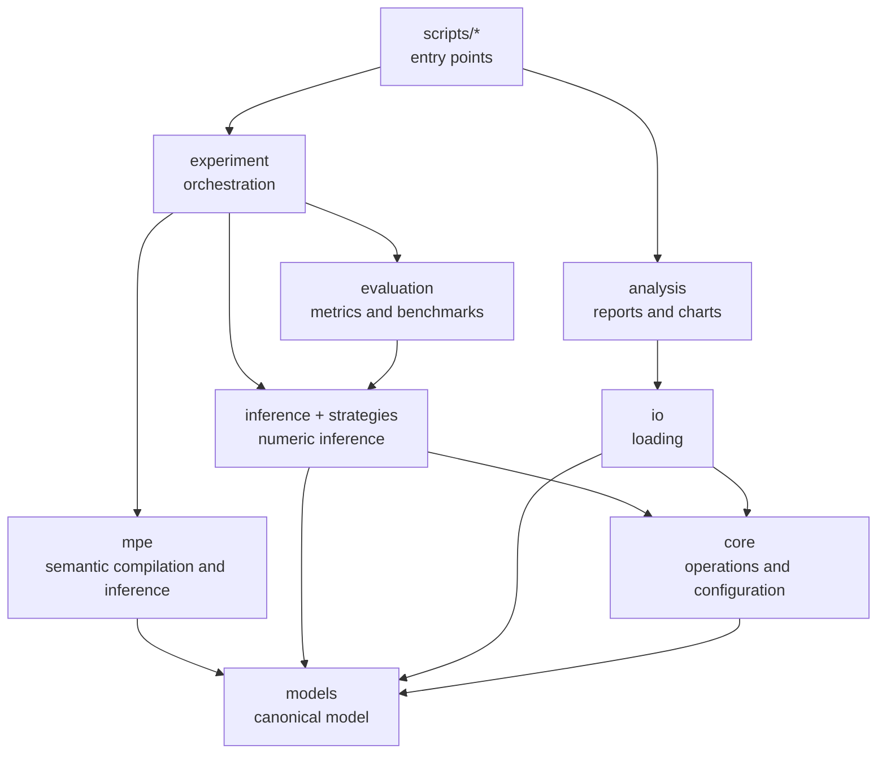

# Architecture

This document describes the architecture implemented in the current code.
The [README](../README.md) is the usage guide; [PROJECT_CONTEXT](PROJECT_CONTEXT.md)
explains the scientific problem; and [AGENTS](AGENTS.md) contains operational
rules for changes to the project.

## 1. Overview

The project contains two pipelines that share the same Bayesian Network model:

1. **Numeric pipeline:** runs Variable Elimination over factors and CPTs,
   using Sum-Product or Max-Product.
2. **Semantic LLM-MPE pipeline:** uses an LLM during a compilation phase to
   produce qualitative decision tables. Subsequent inferences only perform
   lookups on these tables.

The main experiment compares the semantic output with numeric Max-Product,
which serves as the reference.

## 2. Direction of dependencies



Rules for this direction:

- `scripts/` may depend on the application and domain layers, but no reusable
  layer should import `scripts/`;
- scripts do not import other scripts;
- `experiment/` coordinates components, but does not contain mathematical
  factor operations or format parsing;
- `analysis/` contains reusable calculations and visualizations;
  `scripts/analysis/` only selects inputs and runs reports;
- `models/` does not depend on experiments, LLMs, logs, or analysis;
- artifact paths come from `paths.py`, never from local counts of
  `Path.parents`.

## 3. Entry points

### Execution

| Module | Responsibility |
|---|---|
| `scripts.run.main` | Main batch over datasets and different evidence. |
| `scripts.run.main_single_run` | Small run with a fixed dataset and evidence. |
| `scripts.run.run_evidence_pos` | One evidence per node to study its position in the DAG. |
| `scripts.run.synthetic_eval` | Controlled evaluation with a synthetic network. |
| `scripts.run.get_mpe` | Exact Max-Product benchmark versus greedy decoding. |
| `scripts.run.cptless_demo` | Demonstration without a BIF and without numeric CPT. |

### Analysis

| Module | Responsibility |
|---|---|
| `scripts.analysis.metrics` | Aggregate report, correlations, and chart selection. |
| `scripts.analysis.evidence_position` | Analysis of evidence depth. |
| `scripts.analysis.reinference` | Second semantic evaluation via Markov Blanket. |
| `scripts.analysis.get_table` | Structural statistics and LaTeX table. |

These modules must remain thin. If a function is useful outside a single
`main()`, its likely place is `experiment/`, `evaluation/`, or `analysis/`.

## 4. Main experiment flow

The flow starts in `scripts/run/main.py`.

```text
main
 ├─ creates ExperimentConfig
 ├─ selects the client with experiment.llm_factory.build_llm_fn
 └─ for each dataset
     ├─ resolves paths via paths.py
     ├─ loads the numeric network with io.loaders.load_network
     ├─ computes evidence sizes
     ├─ loads or creates the semantic compilation with mpe.cache.load_or_compile
     └─ for each item produced by experiment.batch.run_batch
         ├─ computes the reference with Max-Product
         ├─ queries the compiled messages with mpe.infer
         ├─ computes hits with evaluation.metrics
         └─ writes JSONL with logging.experiment_logger
```

### 4.1 Numeric loading

`io.loaders.load_network(path)` selects a pgmpy reader, decompresses the file
when necessary, and calls `core.conversion.convert_pgmpy_model`.

The result is always a `models.BayesianNetwork` containing:

- `variables: dict[str, Variable]`;
- `factors: list[Factor]` with NumPy values;
- topology derived from the factors.

Supported formats are BIF, XDSL, NET, DSC, and DNE, optionally with `.gz`.

### 4.2 Batch generation

`experiment.batch.run_batch` combines:

- prompt type;
- trial;
- evidence size;
- inference mode (`map` or `mpe`);
- evidence sampling strategy.

The batch only generates configurations. Running a configuration belongs to
`experiment.runner.run_experiment`.

### 4.3 Comparison per configuration

`run_experiment` executes:

1. `experiment.experiment.run_max_product`, using the numeric engine;
2. `mpe.infer.infer_from_compiled`, using the semantic tables;
3. `evaluation.metrics.count_llm_hits`, comparing assignments;
4. assembly of a serializable record for the logger.

In MPE mode, all unobserved variables are evaluated. In MAP mode, only the
query variables are evaluated.

## 5. Numeric pipeline

### Components

- `models.Variable`: name and canonical `states` tuple;
- `models.Factor`: ordered scope and NumPy tensor;
- `models.BayesianNetwork`: collection of variables, factors, and topology;
- `inference.InferenceEngine`: validates the query and coordinates elimination;
- `inference.ve_algorithm`: reduces evidence, chooses order, and eliminates
  variables;
- `strategies.SumProductStrategy`: eliminates by sum;
- `strategies.MaxProductStrategy`: eliminates by max and keeps argmax;
- `inference.postprocessing`: normalizes distributions or reconstructs the
  MAP/MPE.

### Factor convention

For factors representing CPDs:

```text
scope[0]  = child variable
scope[1:] = parents, in the order of the remaining axes
values.shape = tuple(cardinality(v) for v in scope)
```

Changing this convention requires reviewing conversion, sampling, graph
structure, greedy decoding, and tests.

### Distinct configurations

There are two configurations with different scopes:

- `core.config.InferenceConfig`: runtime, environment, LLM client, and numeric
  heuristics;
- `experiment.config.ExperimentConfig`: design of an experiment, trials,
  sampling, mode, and limits.

They should not be merged: one represents infrastructure; the other
represents a scientific run.

## 6. Semantic pipeline

### 6.1 Input

The pipeline accepts two forms of network:

- a BIF dataset, passed via `bif_path`;
- an in-memory `BayesianNetwork`, created by
  `BayesianNetwork.from_structure`, without numeric factors.

In the second case, only names, states, and edges are needed. The structure
must be a DAG.

### 6.2 Compilation

`mpe.compile.compile_semantic_messages` is the sole main step that calls the
LLM. It:

1. uses the semantic BIF network or the in-memory network;
2. loads or generates variable metadata;
3. loads or generates qualitative relationship notes;
4. creates a network briefing;
5. obtains the topological order and uses its reverse as the compilation
   order;
6. creates a `BucketSpec` for each variable;
7. enumerates all combinations of the separator;
8. splits large contexts across calls, when necessary;
9. rigorously validates names, states, and coverage of the returned rows;
10. requests token log-probabilities over short categorical state codes when
    the provider supports them;
11. converts those codes back to canonical `Variable.states` and stores one
    `SemanticMessage` per variable.

The resulting object is `CompiledSemanticMessages`, containing messages,
order, briefing, network, aliases, metadata, notes, traces, and schema
version. `MessageRow.domain_scores` is either a complete score vector for the
variable domain or `None`; partial token alternatives are not presented as a
complete distribution. `MessageRow.token_scores` separately retains the raw
top-token alternatives at the selected-value position for post-hoc analysis;
it may also be `None` when the provider omits log-probabilities.

### 6.3 Current compilation invariant

The current code compiles with `evidence={}` and keeps `active_messages`
empty. This means each message is a local table of the variable conditioned
on its structural separator — usually its parents — and that derived messages
are not propagated between buckets during compilation.

This is an important decision: the implemented behavior is a tabulated,
causal semantic decoding, not a numeric bucket-elimination run. Do not
introduce message propagation or LLM auditing in the online phase as a
"refactor"; this would change the scientific method.

### 6.4 Online inference

`mpe.infer.infer_from_compiled`:

1. normalizes evidence aliases and states;
2. traverses the reconstruction order;
3. keeps observed values fixed;
4. queries the row corresponding to the already-assigned context;
5. returns the hidden assignment, selected confidence, and a representation
   of the tables used for logging.

There is no LLM call in this step. Reconstruction is deterministic for a
given compilation and evidence.

Consequence of the current algorithm: evidence on a descendant does not
trigger a new retroactive semantic inference on its ancestors. Any change to
this is an algorithmic change, not a code reorganization.

## 7. Cache

`mpe.cache.load_or_compile` persists `CompiledSemanticMessages` via pickle in
`src/tables/`.

The active path is:

```text
<dataset>.<model>_VE.compiled.pkl
```

`model_name` is passed through to `compiled_cache_path`. There is, in the
file itself, a commented-out switch to use one file per dataset. This comment
is kept intentionally to toggle experiments.

The cache has a `COMPILED_SCHEMA_VERSION`. A pickle without the current
version is rejected and triggers a new compilation. Since recompiling can
consume credits:

- do not delete caches without an explicit request;
- do not run `main`, `cptless_demo`, or a real compilation as a simple smoke
  test;
- preserve old caches before changing serialized schemas;
- to validate code, use tests with mocks.

## 8. Analysis and logging

`logging.experiment_logger` writes one JSON object per line. The path comes
from `PGM_LOG_FILE_NAME`.

Responsibilities of the `analysis/` layer:

- `logs.py`: reading, defaults for historical fields, and labels;
- `metrics.py`: trial grouping, modal vote, F1, kappa, consensus, and match;
- `structure.py`: parents, children, depth, and cardinality;
- `structural_metrics.py`: merges and Spearman correlations;
- `performance_plots.py` and `structure_plots.py`: visualizations;
- `style.py`: visual constants.

Analysis code does not take part in inference and must not be imported by the
execution pipeline.

## 9. Paths and artifacts

`paths.py` defines paths relative to the `src/` directory:

| Constant | Location |
|---|---|
| `DATASETS_DIR` | `src/datasets/` |
| `METADATA_DIR` | `src/metadata/` |
| `RELATIONSHIPS_DIR` | `src/relationships/` |
| `COMPILED_TABLES_DIR` | `src/tables/` |

Logs are configurable and are usually located in `logs/` at the root when
commands are run from there.

## 10. Architectural decisions

### AD-001 — A single network model

All input is converted to `models.BayesianNetwork`. There must not be
parallel models for the numeric engine and the semantic pipeline.

### AD-002 — `states` is the canonical field

The domain of `Variable` is `states: tuple[str, ...]`. Do not recreate
aliases such as `domain` for local compatibility; adjust the caller to the
canonical model.

### AD-003 — Compile once, infer many times

LLM calls belong to compilation. Inference over evidence must remain
deterministic and cheap.

### AD-004 — Exact reference kept separate from the studied method

Numeric Max-Product produces the ground truth for the experiments. The
semantic pipeline must not consult numeric CPTs to improve its answer.

### AD-005 — Scripts are composition, not domain

Entry points configure and call APIs. Reusable functions live outside
`scripts/`.

### AD-006 — No silent legacy adapters

When a persisted structure changes, prefer versioning and rejecting
incompatible formats over maintaining wrappers indefinitely. Exceptions
should be deliberate when scientific data cannot be reproduced.

### AD-007 — Centralized paths

New artifacts must be registered in `paths.py`; do not derive the project
root inside each script.

## 11. Extension points

- New network format: `io/loaders.py` and `core/conversion.py`.
- New numeric strategy: implement `strategies.base.EliminationStrategy`.
- New sampling: `experiment/sampling.py` and the `batch.py` dispatcher.
- New metric: pure calculation in `evaluation/` or `analysis/`, presented in
  the corresponding script.
- New chart: plotting module in `analysis/`, activated by the entry point.
- New experiment: composition in `scripts/run/`, reusing `experiment/`.
- Change to the compiled format: increment `COMPILED_SCHEMA_VERSION` and
  document the impact.

## 12. Invariants that tests must protect

- a variable's states are unique and there are at least two of them;
- a factor's shape matches its scope;
- every variable referenced by a factor or edge exists in the network;
- networks created by structure are DAGs;
- evidence uses legal names and states;
- LLM responses cover exactly the requested contexts;
- reconstruction never alters evidence;
- compiled inference never calls the LLM;
- incompatible caches are not used silently;
- analyses normalize names with and without the `.bif` suffix.
