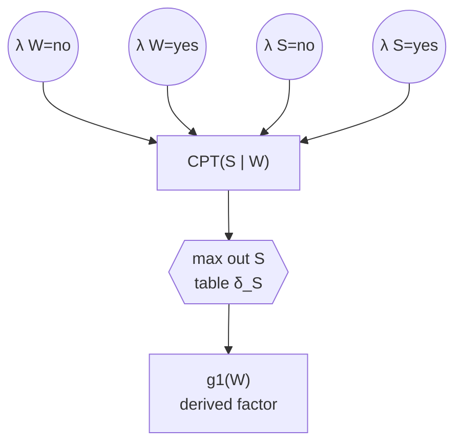
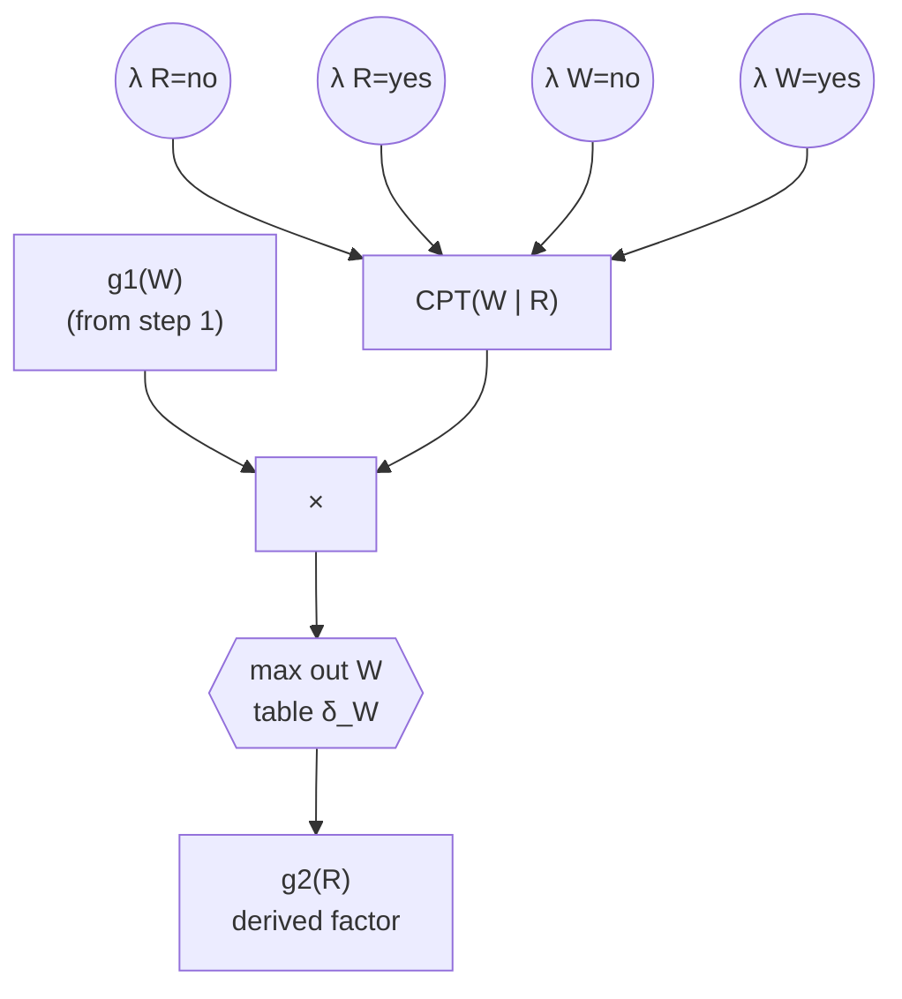
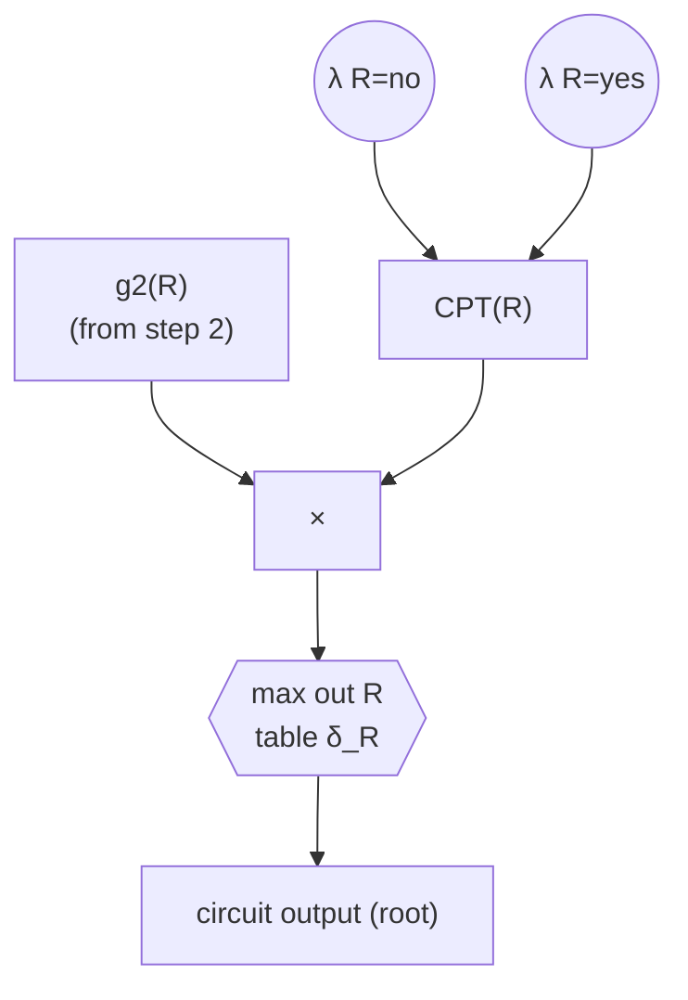
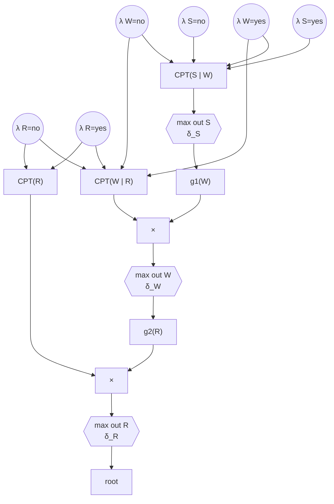

# Semantic Maximizing Circuits

We compile a Bayesian network into a **maximizing circuit** — the arithmetic-circuit construction used for MPE — without using a single numeric probability. During **compilation**, an LLM makes the qualitative choices that numbers would otherwise determine, and every choice is recorded in the circuit. During **inference**, the LLM is never used: we only set the evidence indicators and evaluate the circuit by table lookups.

---

## 1. Background

**Arithmetic circuits.** An arithmetic circuit (AC) compiled from a Bayesian network is a DAG with three ingredients: *indicator leaves* `λ_{X=c}` (one per configuration `c` of each variable `X`), *parameter leaves* holding the numeric probabilities from the CPTs, and *internal nodes* that are products and sums. To answer a query, we set the indicators according to the evidence (`1` if the configuration is consistent with the evidence, `0` otherwise) and evaluate the circuit bottom-up in an *upward pass*.

**Maximizing circuits.** For MPE, every sum node of the AC is replaced by a *max node*. This is the circuit counterpart of variable elimination (VE) for MPE, where the *sum out* operator is replaced by the *max out* operator: instead of summing a variable away, we keep the configuration of the variable that maximizes the factor. Inference on a maximizing circuit has two passes: an upward pass that propagates the evidence, and a downward pass that reads off the maximizing configuration of each variable — together they return the MPE assignment.

## 2. What is semantic about it

We start from the network structure alone: the variables, their possible configurations, and the CPT graph (which variable has which parents). The CPTs carry **no numbers**, so there are no parameters to place in the leaves of a classical circuit. A *semantic maximizing circuit* keeps the circuit shape — a DAG of product nodes and max nodes with indicator leaves — but every operation that would have required numbers is resolved **once, by the LLM, at compilation time**. The consequences are stored as small tables at the max nodes. The data structures are:

- **Semantic CPT factor.** For each family (a variable `X` and its parents `U`), the CPT of `X` is kept as a factor over `{X} ∪ U` with no numeric values. The CPTs are the initial factors, exactly as in VE.
- **Product node.** When a variable is eliminated, all current factors that involve it are multiplied into one factor, as in VE. Since there are no numbers, the product is *semantic*: it is the LLM's job, at compilation time, to weigh the multiplied factors together when making its choice.
- **Max node with a recorded table `δ_X`.** For each eliminated variable `X`, the max out step asks: *for each configuration of the remaining variables, which configuration of `X` maximizes the factor?* The LLM answers this question, and its answers are stored as a table `δ_X` at the max node.
- **Derived factor.** After `X` is eliminated, the result is a new factor over the remaining variables, represented by the recorded table `δ_X`. This factor participates in later eliminations, again as in VE.
- **Indicator leaves.** One indicator `λ_{X=c}` per configuration of every variable, exactly as in a classical AC. An indicator set to `0` deletes every row of every recorded table that mentions that configuration.

## 3. Phase 1 — Compilation (uses the LLM; runs once; ignores evidence)

**Input:** the network structure (variables, configurations, CPT graph — no numbers) and an elimination order.

1. Start with the CPTs as the initial factors.
2. For each variable `X` in the elimination order:
   1. **Collect and multiply.** Gather every current factor that involves `X` and multiply them into a single factor `f(X, Y₁, …, Y_m)`, where `Y₁, …, Y_m` are the other variables appearing in those factors.
   2. **Max out `X`.** For every configuration of the remaining variables `Y₁, …, Y_m` — **all** configurations, because no evidence is assumed during compilation — ask the LLM: *given the semantics of the multiplied factors, which configuration of `X` makes `f` most plausible?* The prompt requires exactly one answer per configuration, so the LLM itself resolves any ties.
   3. **Record.** Store the answers as the table `δ_X` at the max node.
   4. **Replace.** Delete the factors that were multiplied together and add the derived factor over `Y₁, …, Y_m` (represented by `δ_X`) to the pool of current factors.
3. The last elimination produces a factor over no variables — the root of the circuit.

**Output:** the compiled semantic maximizing circuit: the DAG of product and max nodes, the recorded tables `δ_X`, and the indicator leaves.

## 4. Phase 2 — Inference (no LLM; per query)

**Input:** the compiled circuit and evidence `e` (possibly empty).

1. **Set the indicators.** `λ_{X=c} ← 1` if `c` is consistent with the evidence (all indicators are `1` when there is no evidence), else `0`.
2. **Upward pass — delete rows, carry the evidence up.** Walk the circuit bottom-up, in the order the variables were eliminated. At the max node of `X` with table `δ_X`:
   - Delete the rows inconsistent with what is already known (observed configurations, and configurations narrowed by earlier steps of this pass).
   - If `X` was observed as `c`, also delete the rows whose recorded maximizing configuration differs from `c`. The configurations of the remaining variables that survive in the kept rows narrow what is still possible for the rest of the circuit — this is how the evidence travels upward.
   - If all rows of a table are deleted, keep the table as it was: the observation is atypical for this factor and simply does not propagate through it.
3. **Downward pass — read off the assignment.** Walk the circuit top-down, in reverse elimination order. For each variable `X`:
   - If `X` was observed, assign the observed configuration.
   - Else, if the upward pass narrowed `X` to a single configuration, assign that one.
   - Else, look up `δ_X` at the current configuration of `Y₁, …, Y_m` (already assigned) and assign the recorded maximizing configuration.
4. **Output:** the complete assignment — the answer to the MPE query.

Because compilation tabulated the LLM's choice for *every* configuration of the remaining variables, the circuit can answer **any** evidence configuration: inference is nothing more than setting indicators, deleting rows, and looking up tables.

---

## 5. A complete example

Consider a small network with three binary variables:

- `R` = Rain, configurations `no` / `yes`
- `W` = Grass wet, configurations `no` / `yes`
- `S` = Path slippery, configurations `no` / `yes`

with edges `R → W → S`. The CPTs are `CPT(R)`, `CPT(W | R)`, and `CPT(S | W)` — all semantic, no numbers. We use the elimination order **S, W, R** (a reverse topological order; any order is allowed, only the circuit shape changes).

### 5.1 Compilation, step 1: eliminate `S`

Only one factor involves `S`, so the product is the factor itself:

```
f₁(W, S) = CPT(S | W)
g₁(W)    = max_S  f₁(W, S)
```

We ask the LLM, for each configuration of the remaining variable `W`: *which configuration of `S` is most plausible?* The LLM knows that wet grass makes slipping more plausible, and dry grass makes not slipping more plausible. It answers:

| `W` | maximizing configuration of `S` (`δ_S`) |
|------|------------------------------------------|
| no   | no |
| yes  | yes |

The circuit so far:



We delete `CPT(S | W)` from the pool and add the derived factor `g1(W)`.

### 5.2 Compilation, step 2: eliminate `W`

Two factors now involve `W`: the CPT `CPT(W | R)` and the derived factor `g1(W)` from step 1. They are multiplied:

```
f₂(R, W) = CPT(W | R) × g1(W)
g₂(R)    = max_W  f₂(R, W)
```

This is the first real product node: when the LLM chooses the maximizing configuration of `W`, it must weigh both inputs together — the semantics of the family `W | R` *and* the recorded choices sitting in `g1(W)`. We ask, for each configuration of the remaining variable `R`: *which configuration of `W` is most plausible?* Rain wets the grass; without rain the grass stays dry:

| `R` | maximizing configuration of `W` (`δ_W`) |
|------|------------------------------------------|
| no   | no |
| yes  | yes |

The circuit grows:



We delete `CPT(W | R)` and `g1(W)` from the pool and add `g2(R)`.

### 5.3 Compilation, step 3: eliminate `R`

Two factors involve `R`: `CPT(R)` and the derived factor `g2(R)`:

```
f₃(R) = CPT(R) × g2(R)
g₃    = max_R  f₃(R)
```

There are no remaining variables, so the table `δ_R` has a single row: with no context left, the LLM answers which configuration of `R` is most plausible a priori. A dry day is more common than rain:

| (no remaining variables) | maximizing configuration of `R` (`δ_R`) |
|--------------------------|------------------------------------------|
| – | no |

The last piece of the circuit:



### 5.4 The assembled circuit

Putting the three steps together, the compiled semantic maximizing circuit is:



Compilation is done. The circuit holds three recorded tables — `δ_R`, `δ_W`, `δ_S` — with two rows each, and it never calls the LLM again.

### 5.5 Query 1: no evidence

**Set the indicators.** There is no evidence, so every indicator is `1` and no row is deleted anywhere.

**Downward pass.** We walk the circuit top-down in reverse elimination order, `R`, then `W`, then `S`:

1. `R`: the table `δ_R` has one row with an empty context, recording `no`. Assign **`R = no`**.
2. `W`: look up `δ_W` at the current configuration of its remaining variable, `R = no`. The table records `no`. Assign **`W = no`**.
3. `S`: look up `δ_S` at `W = no`. The table records `no`. Assign **`S = no`**.

**Answer:** `(R, W, S) = (no, no, no)` — by default, the most plausible explanation of the network is a dry day.

### 5.6 Query 2: evidence `S = yes`

**Set the indicators.** `λ_{S=yes} ← 1`, `λ_{S=no} ← 0`; all other indicators stay `1`.

**Upward pass.** We walk bottom-up in elimination order, `S`, then `W`, then `R`:

1. At the max node of `S`: `S` was observed as `yes`, so we delete the rows of `δ_S` whose recorded maximizing configuration differs from `yes`:

   | `W` | `δ_S` |
   |------|-------|
   | ~~no~~ | ~~no~~ |
   | yes  | yes |

   The only surviving context is `W = yes`. The evidence has traveled up one level: `W` is now narrowed to `yes`.
2. At the max node of `W`: we delete the rows of `δ_W` inconsistent with `W = yes`:

   | `R` | `δ_W` |
   |------|-------|
   | ~~no~~ | ~~no~~ |
   | yes  | yes |

   The only surviving context is `R = yes`. The evidence has traveled up another level: `R` is narrowed to `yes`.
3. At the max node of `R`: the single row of `δ_R` records the a priori preference `no`, which is inconsistent with what we now know (`R = yes`), so every row would be deleted. By our rule, we keep the table as it was — the observation simply does not propagate through this factor. The narrowing `R = yes` from step 2 stands.

**Downward pass.** Again `R`, then `W`, then `S`:

1. `R`: not observed, but narrowed to a single configuration by the upward pass. Assign **`R = yes`** (the narrowed value takes precedence over the table `δ_R`).
2. `W`: narrowed to `yes` during the upward pass. Assign **`W = yes`**. (The lookup agrees: `δ_W` at `R = yes` also records `yes`.)
3. `S`: observed. Assign **`S = yes`**.

**Answer:** `(R, W, S) = (yes, yes, yes)` — the slippery path is explained by wet grass, and the wet grass by rain. Note how the evidence flipped the answer for `R` compared to Query 1, where the a priori preference `no` won.

---

## 6. Remarks

- **The LLM is compilation-only.** Every LLM call is a pure function of a configuration of the remaining variables, tabulated over *all* configurations at compilation time. Inference only sets indicators, deletes rows, and looks up tables.
- **Size.** The circuit has one table per eliminated variable, with one row per configuration of the remaining variables. The total number of rows is therefore exponential only in the largest number of remaining variables at any elimination step — the same quantity that governs the cost of VE and the size of a classical AC.
- **Evidence is unrestricted.** Because compilation never assumed any evidence, the same compiled circuit answers any query: with evidence, with partial evidence, or with none at all.
